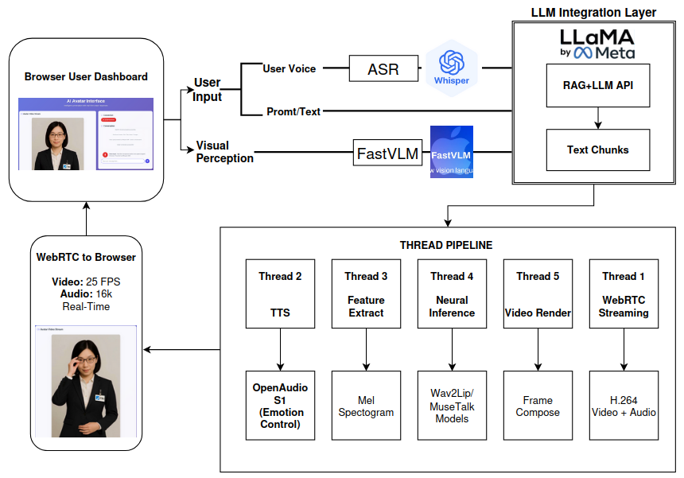

# Avatar-V2: Real-time Digital Avatar System

Advanced real-time digital avatar system supporting both **Wav2Lip** and **MuseTalk** models for lip-sync video generation with live audio processing, **OpenAudio S1 emotional TTS**, **FastVLM visual perception**, and **WebRTC streaming**.



## 🌟 New Features in V2

- **🎭 OpenAudio S1 Emotional TTS**: Fish Audio's 4B parameter model with emotional tag control
- **👁️ FastVLM Visual Perception**: Real-time visual context analysis for personalized interactions
- **🔗 LLM Integration API**: Clean HTTP interface for external LLM systems to access visual context
- **🎯 Enhanced Performance**: Sub-200ms latency with 5-thread parallel processing
- **🌐 Multi-session Support**: Concurrent user support with isolated processing pipelines

## Demo Videos

**[View Demo Videos](https://drive.google.com/drive/folders/1Jk3QjjG2c5-Ah3EKlVCbWPb0BFR18lRb?usp=drive_link)**

## Features

### Core Avatar Generation
- **Real-time Avatar Generation**: Live lip-sync video generation at 25 FPS
- **Dual Model Support**: 
  - **Wav2Lip**: High-speed 256x256 lip synchronization for efficiency
  - **MuseTalk**: Advanced diffusion-based avatar with superior facial expressions
- **WebRTC Streaming**: Low-latency browser-based video streaming
- **Multi-session Architecture**: Concurrent client connections with isolated processing

### Advanced AI Integration
- **OpenAudio S1 TTS**: Emotional text-to-speech with tags like (excited), (calm), (confused), (regretful)
- **FastVLM Visual Perception**: Real-time analysis of user demographics, expressions, and environment
- **EdgeTTS Fallback**: Reliable backup TTS system for enhanced stability
- **Custom Avatar Creation**: Generate personalized avatars from user videos

### Technical Capabilities
- **5-Thread Pipeline**: Parallel processing for WebRTC, TTS, feature extraction, neural inference, and video rendering
- **Sub-200ms Latency**: Real-time conversational interaction
- **Cross-platform Compatibility**: Works on Chrome, Firefox, Safari without plugins
- **Recording Capabilities**: Save avatar sessions as MP4 videos

## Requirements

- **OS**: Linux (Ubuntu 20.04+ recommended)
- **GPU**: NVIDIA GPU with CUDA support (>= 8GB VRAM recommended for MuseTalk, 4GB for Wav2Lip)
- **Python**: 3.8-3.10
- **CUDA**: 12.4 (or compatible)
- **FFmpeg**: System package required

## Installation

### 1. Clone Repository
```bash
git clone https://github.com/HelloHe110/ITRI_chatbot.git
cd ITRI_chatbot/Avatar-V2
```

### 2. Download Required Files
Download the Avatar-V2.zip file containing the required models, data, and FastVLM components:

```bash
# Download Avatar-V2.zip from https://drive.google.com/file/d/17C1GFOqsdqjZ42EyMotdN3OXh5vjyFUx/view?usp=sharing
# Extract the file to get these folders:
unzip Avatar-V2.zip
# This will create:
# ./models/         - Pre-trained models (wav2lip.pth, MuseTalk models, Whisper, etc.)
# ./data/           - Avatar data (wav2lip256_avatar, musetalk_avatar)
# ./ml-fastvlm/     - FastVLM model for visual perception
```

**Required structure after extraction:**
```
Avatar-V2/
├── models/
│   ├── wav2lip.pth
│   ├── musetalkV15/
│   ├── sd-vae/
│   ├── whisper/
│   └── ...
├── data/
│   └── avatars/
│       ├── wav2lip256_avatar/
│       └── musetalk_avatar/
├── ml-fastvlm/
│   ├── llava-fastvithd_0.5b_stage3/
│   └── ...
└── app.py
```

### 3. Create Conda Environment
```bash
# Create new conda environment
conda create -n avatar-v2 python=3.10 -y
conda activate avatar-v2

# Install PyTorch with CUDA support
conda install pytorch==2.5.0 torchvision==0.20.0 torchaudio==2.5.0 pytorch-cuda=12.4 -c pytorch -c nvidia

# Install Python dependencies
pip install -r requirements.txt
```

### 4. Additional Dependencies for MuseTalk (Optional)
If you plan to use the MuseTalk model for higher quality avatars:

```bash
# Install MMDetection dependencies
conda install ffmpeg
pip install --no-cache-dir -U openmim 
mim install mmengine 
mim install "mmcv>=2.0.1" 
mim install "mmdet>=3.1.0" 
mim install "mmpose>=1.1.0"
```

### 5. System Dependencies
```bash
# Ubuntu/Debian
sudo apt update
sudo apt install ffmpeg -y

# Verify CUDA installation
nvidia-smi
python -c "import torch; print(f'CUDA available: {torch.cuda.is_available()}')"
```

## Usage

### Basic Avatar System

#### Wav2Lip (Fast & Efficient)
```bash
python app.py --transport webrtc --model wav2lip --avatar_id wav2lip256_avatar --REF_FILE zh-CN-XiaoxiaoNeural --tts openaudio --listenport 8010
```

#### MuseTalk (High Quality)
```bash
python app.py --transport webrtc --model musetalk --avatar_id musetalk_avatar --REF_FILE zh-CN-XiaoxiaoNeural --tts openaudio --listenport 8010
```

### With Visual Perception (Enhanced Features)

To enable visual perception for personalized avatar interactions:

#### 1. Start Visual Perception API (Terminal 1)
```bash
python vision_api_multi_session.py
# API will run on port 5004
```

#### 2. Start Avatar System (Terminal 2)
```bash
python app.py --transport webrtc --model musetalk --avatar_id musetalk_DLee --listenport 8010 --tts openaudio
```

### Accessing the Interface
Open your browser and navigate to:
- **Main Interface**: `http://localhost:8010/webrtcapi.html`
- **Dashboard (Recommended)**: `http://localhost:8010/dashboard.html`
- **Visual Context API**: `http://localhost:5004/visual-context/{sessionid}` (for LLM integration)

### Command Line Parameters
- `--model`: Choose between `wav2lip` (fast) or `musetalk` (high quality)
- `--avatar_id`: Avatar to use (e.g., `wav2lip256_avatar`, `musetalk_avatar`)
- `--REF_FILE`: TTS voice (see available voices below)
- `--tts`: TTS engine (`openaudio` for emotional tags, `edgetts` for fallback)
- `--listenport`: Server port (default: 8010)
- `--batch_size`: Inference batch size (default: 16)

### Available TTS Voices
#### OpenAudio S1 (Recommended - with emotional tags)
- **English**: `en-GB-SoniaNeural`
- **Chinese**: `zh-CN-XiaoxiaoNeural`

#### EdgeTTS (Fallback)
- **English**: `en-GB-SoniaNeural` 
- **Chinese**: `zh-CN-XiaoxiaoNeural`

### Emotional Tags (OpenAudio S1)
Use emotional tags for enhanced speech expression:
- `(excited)` - Energetic, enthusiastic tone
- `(calm)` - Peaceful, relaxed tone  
- `(confused)` - Uncertain, questioning tone
- `(regretful)` - Apologetic, sorry tone

## Creating Custom Avatars

### For Wav2Lip
```bash
cd wav2lip
python genavatar.py --video_path /path/to/your/video.mp4 --img_size 256 --avatar_id your_avatar_name

# Copy generated files to data folder
cp -r results/avatars/your_avatar_name ../data/avatars/
```

### For MuseTalk
```bash
python genavatar_musetalk.py --file /path/to/your/video.mp4 --avatar_id your_musetalk_avatar
# Files are automatically saved to data/avatars/
```

**Video Requirements:**
- **Duration**: 10-60 seconds
- **Quality**: HD (1080p recommended)
- **Content**: Clear frontal face view
- **Lighting**: Good, consistent lighting
- **Background**: Static or minimal movement

## API Endpoints

### Avatar System
- `POST /offer` - Establish WebRTC connection
- `POST /human` - Send text for avatar to speak
- `POST /interrupt_talk` - Stop current speech
- `POST /is_speaking` - Check if avatar is speaking
- `POST /humanaudio` - Upload audio file
- `POST /process_voice` - Process voice with Whisper ASR

### Visual Perception API (Port 5004)
- `GET /visual-context/{sessionid}` - Get visual analysis for session
- `GET /sessions` - List all active sessions with vision enabled

Example visual context response:
```json
{
  "sessionid": "123456",
  "visual_context": "Young female, mid-20s, wearing blue sweater, smiling, in bright office environment",
  "available": true
}
```

## System Performance

| Model     | VRAM Usage | Processing Speed | Quality Level | Best Use Case |
|-----------|------------|------------------|---------------|---------------|
| Wav2Lip   | ~2GB       | 25 FPS          | Good          | Fast response, efficiency |
| MuseTalk  | ~6GB       | 15-20 FPS       | Excellent     | High quality, presentations |

### Performance Metrics
- **Video Output**: 25 FPS real-time generation
- **Total Latency**: <200ms pipeline processing
- **Concurrent Sessions**: Multiple user support
- **Browser Compatibility**: Chrome, Firefox, Safari

## Technical Architecture

### Processing Pipeline
1. **User Input** → ASR (Whisper) → Text Processing
2. **Visual Analysis** → FastVLM → Context API
3. **Text** → TTS (OpenAudio S1/EdgeTTS) → Audio Stream
4. **Audio + Context** → Avatar Model → Generated Frames
5. **Generated Video** → WebRTC → Browser Client

### Threading Architecture
- **Thread 1**: WebRTC Streaming
- **Thread 2**: TTS Processing (OpenAudio S1)
- **Thread 3**: Feature Extraction (Mel/Whisper)
- **Thread 4**: Neural Inference (Wav2Lip/MuseTalk)
- **Thread 5**: Video Rendering & Encoding

## Troubleshooting

### Common Issues

**CUDA Out of Memory**
```bash
# For MuseTalk, reduce batch size
python app.py --model musetalk --batch_size 8

# Or use Wav2Lip for lower memory usage
python app.py --model wav2lip
```

**Model Loading Errors**
- Verify Avatar-V2.zip was extracted correctly
- Check file permissions: `chmod -R 755 models/ data/ ml-fastvlm/`
- Ensure sufficient disk space (>20GB)

**Visual Perception Not Working**
- Ensure `python vision_api_multi_session.py` is running on port 5004
- Check that FastVLM models are properly extracted in `ml-fastvlm/`
- Verify webcam permissions in browser

**Audio Quality Issues**
- Try switching between `--tts openaudio` and `--tts edgetts`
- Check microphone permissions and quality
- Ensure proper audio codec support

### Performance Optimization
- Use Wav2Lip for faster processing with limited GPU memory
- Use MuseTalk for presentations requiring high visual quality  
- Enable visual perception only when personalization is needed
- Monitor GPU memory usage with `nvidia-smi`

## Contributing

For questions, suggestions, or contributions, please open an issue or submit a pull request.

## License

This project is developed for ITRI (Industrial Technology Research Institute) educational and demonstration purposes.

---

**Powered by OpenAudio S1 + FastVLM + WebRTC | Built for ITRI Avatar Technology 🎭**
